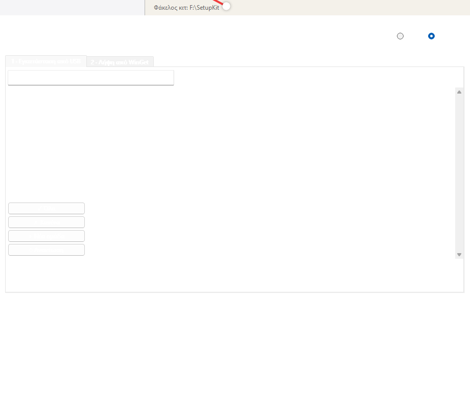

# KIT Installer

A portable Windows app for **offline software installation from USB**.

Groups installers into categories, extracts icons from the .exe files,
and runs them silently with one click. Also downloads packages via WinGet.



## Features

- **Grouped cards view** — programs shown in a Linux-repo-style card grid with icons
- **Hover tooltip** — file size, silent-switch status on mouse hover
- **Smart search** — filters programs by name across all groups
- **Silent install** — runs .exe/.msi with known silent switches (7-Zip, Chrome, VLC, etc.)
- **WinGet download** — search and download packages from the WinGet catalog
- **Custom silent rules** — extend via `apps.json`
- **Portable** — single .exe, no installation needed, runs off any USB drive
- **Bilingual** — English and Greek (auto-detects Windows language)

## How to use

1. **Prepare a USB drive**: create folders under `installs\` for each group
   (e.g. `installs\Browsers\`, `installs\Tools\`)

2. **Add installers**: place `.exe` or `.msi` files in the group folders

3. **Run KIT-Installer.exe** — it automatically scans the `installs\` folder

4. **Install**: select programs with checkboxes, click INSTALL SELECTED

5. **Download more**: use Tab 2 to search WinGet and download installers
   directly into the kit folders

## Silent rules

Built-in: `7-Zip`, `Chrome`, `VLC`, `LibreOffice`, `SumatraPDF`, `AnyDesk`.

For custom rules, edit `apps.json`:

```json
{
  "rules": {
    "firefox": ["/S"],
    "notepadpp": ["/S"]
  }
}
```

## Build from source

```powershell
pip install pyinstaller pillow
pyinstaller --clean --onefile --windowed --uac-admin --name="KIT-Installer" --icon=icon.ico --collect-data PIL installer_gui.py
```

## License

MIT — free to use, modify, and distribute.